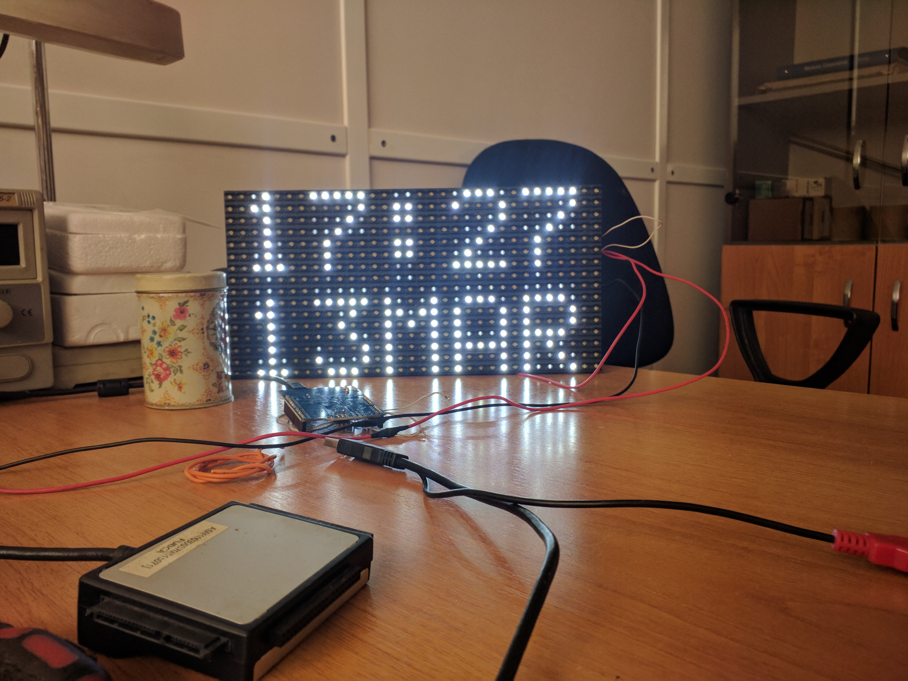

# DMD Watch

Часы на базе **ESP8266** и светодиодной DMD-матрицы. Устройство подключается к Wi-Fi, получает точное время по NTP и выводит на дисплей время и дату. Поддерживается обновление прошивки через ArduinoOTA.



## Возможности

- отображение времени в формате `ЧЧ:ММ`;
- отображение дня и месяца;
- подключение к Wi-Fi в режиме Station;
- синхронизация времени через NTP;
- автоматическое обновление времени после подключения к сети;
- встроенный светодиод ESP8266 для индикации состояния;
- вывод диагностических сообщений через Serial;
- обновление прошивки по локальной сети через ArduinoOTA;
- минимальное количество внешних компонентов.

## Архитектура

```text
ESP8266
  ├── Wi-Fi
  ├── NTP (pool.ntp.org)
  ├── Serial 115200
  ├── ArduinoOTA
  └── SPI → DMD LED matrix
```

ESP8266 подключается к домашней Wi-Fi сети, получает IP-адрес, синхронизирует часы с NTP-сервером и обновляет DMD-дисплей. Физические кнопки, датчики, MQTT и web-интерфейс в проекте не используются.

## Оборудование

- ESP8266 с поддержкой Wi-Fi;
- DMD LED matrix, совместимая с библиотекой `DMD2`;
- источник питания, подходящий для конкретной платы ESP8266;
- провода и общий провод земли между ESP8266 и DMD;
- резистор/уровневая защита, если DMD-модуль использует логический уровень 5 В.

В коде задан один DMD-панель размером `1 × 1`. Это обычно соответствует одной матрице 32×32, но фактическое разрешение и напряжение питания нужно проверить по модели установленного дисплея.

## Подключение DMD

В `DMD_WATCH.ino` заданы следующие пины:

| Сигнал | GPIO ESP8266 | Назначение |
|---|---:|---|
| `pin_A` | 16 | DMD A |
| `pin_B` | 12 | DMD B |
| `pin_sclk` | 4 | SPI clock |
| `pin_noe` | 15 | DMD enable / NOE |
| `ONBOARDLED` | 2 | встроенный LED платы |

Подключение выполняется по SPI-интерфейсу DMD. Перед подачей питания проверь распиновку именно своей платы: обозначения `A`, `B`, `SCLK` и `NOE` на разных модулях могут располагаться в разном порядке.

## Настройка Wi-Fi

Параметры Wi-Fi находятся в отдельном файле:

```text
WifiConfig.h
```

Пример безопасной конфигурации:

```cpp
#define YOUR_WIFI_SSID "YOUR_WIFI_SSID"
#define YOUR_WIFI_PASSWD "YOUR_WIFI_PASSWD"
```

Замени значения на свои данные, но не добавляй настоящий пароль в публичный репозиторий.

Текущий файл `WifiConfig.h` содержит заданные значения доступа к сети. Поскольку репозиторий публичный, если это реальные данные, смени пароль Wi-Fi и не оставляй действующие учётные данные в исходниках.

## Настройка времени

В коде используются:

```text
NTP-сервер: pool.ntp.org
Часовой пояс: +6
Минуты часового пояса: 0
Интервал синхронизации: 63
```

Параметры находятся в начале `DMD_WATCH.ino`:

```cpp
int8_t timeZone = 6;
int8_t minutesTimeZone = 0;
```

Если устройство используется в другом часовом поясе, измени `timeZone` и при необходимости `minutesTimeZone`.

## Прошивка

Проект собирается как обычный Arduino sketch:

1. Установи Arduino IDE.
2. Установи поддержку плат ESP8266 через Boards Manager.
3. Установи библиотеку `DMD2` и шрифт `SystemFont5x7`.
4. Установи или распакуй библиотеки из папки `Libraries`:
   - `NtpClient-master.zip`;
   - `Time-master.zip`.
5. Открой файл `DMD_WATCH.ino`.
6. Укажи правильную плату ESP8266 и параметры загрузки.
7. Выбери последовательный порт ESP8266.
8. Загрузи sketch.

В репозитории нет файла `platformio.ini`; стандартная сборка выполняется через Arduino IDE.

## Serial и диагностика

После запуска Serial работает на скорости:

```text
115200 baud
```

В мониторе порта будут сообщения о:

- подключении к SSID;
- получении IP-адреса;
- отключении от сети;
- синхронизации NTP;
- ошибках NTP;
- времени и uptime;
- состоянии Wi-Fi.

## OTA-обновление

В прошивке включён `ArduinoOTA`. После подключения к той же локальной сети Arduino IDE может увидеть устройство и выполнить обновление.

### Важно

В текущем коде вызывается:

```cpp
ArduinoOTA.begin();
```

Имя устройства и пароль OTA явно не задаются. Не используйте OTA в открытой или недоверенной сети. Перед применением обновления добавьте:

- уникальное имя устройства;
- пароль OTA;
- ограничение доступа по IP или VLAN;
- отдельную защищённую сеть для прошивки.

## Структура репозитория

```text
DMD_WATCH.ino       основной Arduino sketch
WifiConfig.h        параметры Wi-Fi
Libraries/          архивы NtpClient и Time
images/             фотографии устройства
IMG_*.jpg           фотографии в корне репозитория
```

## Ограничения

- проект использует ESP8266 и не подходит для прошивки на ESP32 без адаптации;
- DMD2 и SystemFont5x7 должны быть установлены отдельно;
- разрешение DMD-панели зависит от физического дисплея;
- часы зависят от доступности NTP-сервера;
- после потери Wi-Fi время может оставаться на последнем полученном значении;
- точность и правильность часового пояса нужно проверить после первой синхронизации;
- ArduinoOTA в исходной конфигурации не защищено паролем;
- GPIO-пины DMD фиксированы в коде и могут конфликтовать с другими подключениями;
- проект старый, поэтому перед современной сборкой может потребоваться обновление библиотек ESP8266.

## Электробезопасность

Питание DMD и ESP8266 должно соответствовать требованиям конкретных модулей. Не подавай 5 В непосредственно на GPIO ESP8266. Проверь:

- уровни логических сигналов;
- наличие общей земли;
- ток потребления панели;
- стабильность источника питания;
- отсутствие короткого замыкания между линиями питания.

## Лицензия и авторство

В начале `DMD_WATCH.ino` присутствует BSD-подобное уведомление об авторских правах German Martin. Отдельный файл `LICENSE` в репозитории не добавлен, поэтому перед публичным распространением необходимо отдельно определить условия лицензирования.
